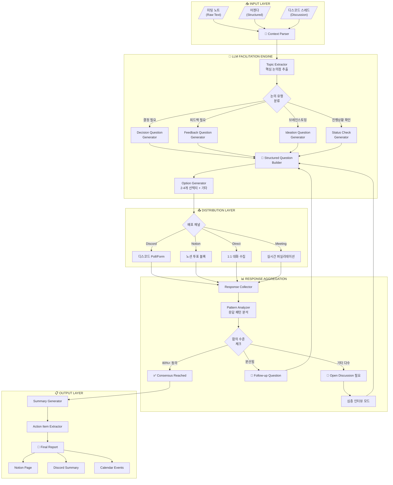

# LLM 기반 피드백 퍼실리테이션 시스템

> **미팅 노트/어젠다 → LLM → 구조화된 질문 → 자동 수집 → 액션 아이템**

---

## 🎯 시스템 개요

### 목적
미팅 노트나 어젠다를 LLM에게 제공하면, AskUserQuestion 방법론에 기반한 **구조화된 피드백 질문**을 자동 생성하고, 팀원 응답을 수집하여 **실행 가능한 결론**을 도출합니다.

### 핵심 가치
```
┌────────────────────────────────────────────────────────────┐
│  Human: 맥락(Context) 제공                                 │
│  LLM: 구조화(Structure) + 퍼실리테이션(Facilitation)       │
│  Human: 의사결정(Decision)                                 │
│  LLM: 문서화(Documentation) + 추적(Tracking)               │
└────────────────────────────────────────────────────────────┘
```

---

## 🔧 시스템 구성

### Architecture Overview



### 간략 구조

```
┌─────────────┐     ┌──────────────────┐     ┌─────────────┐
│   INPUT     │────▶│  LLM FACILITATOR │────▶│   OUTPUT    │
│             │     │                  │     │             │
│ • 미팅노트  │     │ • Topic Extract  │     │ • Questions │
│ • 어젠다    │     │ • Question Gen   │     │ • Summary   │
│ • 디스코드  │     │ • Response Parse │     │ • Actions   │
└─────────────┘     └──────────────────┘     └─────────────┘
```

---

## 📋 워크플로우 상세

### Workflow 1: 비동기 피드백 수집 (Async)

**시나리오**: 미팅 후 팀원들에게 피드백 수집

```
[미팅 종료] 
    ↓
[미팅 노트를 LLM에게 전달]
    ↓
[LLM이 핵심 토픽 추출 + 질문 생성]
    ↓
[디스코드/노션으로 질문 배포]
    ↓
[24-48시간 응답 수집]
    ↓
[LLM이 응답 분석 + 요약]
    ↓
[Action Item 생성 → Notion 기록]
```

#### Step 1: 미팅 노트 제공

```markdown
## 입력 예시

다음은 오늘 HyperProof 주간 싱크 미팅 노트입니다:

---
**일시**: 2026-01-20 14:00
**참석자**: Jay, 멤버A, 멤버B, 멤버C

**논의 사항**:
1. AI 워크샵 커리큘럼 - MCP vs Agentic Coding 중 우선순위
2. 팟캐스트 런칭 - 주 1회 vs 격주 논의
3. 콘텐츠 배포 채널 - 유튜브 shorts 추가 검토
4. 다음 주 오프라인 모임 장소

**결정 필요**:
- 워크샵 주제 선정 (이번 주 내)
- 팟캐스트 주기 확정

**보류**:
- 콘텐츠 채널은 추가 데이터 필요
---

이 내용을 바탕으로 팀원들에게 피드백을 수집할 구조화된 질문을 생성해주세요.
```

#### Step 2: LLM 질문 생성 (자동)

```markdown
## LLM 출력 예시

### 📊 HyperProof 주간 싱크 피드백

**토픽 1: AI 워크샵 주제 선정** [결정 필요 - 긴급]

Q1. 다음 워크샵 주제로 어떤 것이 좋을까요?
① MCP 서버 개발 (권장) - 실무 즉시 적용 가능
② Agentic Coding 심화 - 트렌드 선점
③ 두 주제 병행 (2회 시리즈) - 둘 다 커버
④ 다른 주제 제안

Q2. 워크샵 형식은 어떤 게 좋을까요?
① 이론 30% + 실습 70%
② 이론 50% + 실습 50%
③ 풀 핸즈온 (실습 위주)
④ 기타 형식 제안

---

**토픽 2: 팟캐스트 주기** [결정 필요]

Q3. 팟캐스트 발행 주기는?
① 주 1회 (권장) - 꾸준한 노출
② 격주 - 퀄리티 집중
③ 월 1회 - 딥다이브 에피소드
④ 유연하게 (콘텐츠 준비되면)

---

**토픽 3: 오프라인 모임 장소** [의견 수집]

Q4. 다음 주 오프라인 모임 장소 선호는?
① 강남역 근처
② 판교/분당
③ 홍대/합정
④ 기타 (위치 제안)
```

#### Step 3: 배포 및 수집

**디스코드 배포 템플릿**:
```
🎯 *HyperProof 주간 피드백 요청*

미팅에서 논의된 사항들에 대해 의견 부탁드려요!
⏰ 마감: 내일 (1/21) 18:00

아래 스레드에서 각 질문에 번호로 답변해주세요.
(예: Q1-①, Q2-③, Q3-②, Q4-기타:성수동)

---
[질문 내용 붙여넣기]
```

#### Step 4: 응답 분석 요청

```markdown
## 입력

다음은 수집된 팀원 응답입니다:

멤버A: Q1-①, Q2-①, Q3-①, Q4-②
멤버B: Q1-③, Q2-①, Q3-②, Q4-①
멤버C: Q1-①, Q2-③, Q3-①, Q4-기타:성수동
Jay: Q1-①, Q2-①, Q3-①, Q4-②

이 응답을 분석하고 합의점과 Action Item을 정리해주세요.
```

#### Step 5: LLM 분석 결과 (자동)

```markdown
## 📋 피드백 분석 결과

### 합의 현황

| 토픽 | 결과 | 합의율 | 상태 |
|------|------|--------|------|
| 워크샵 주제 | MCP 서버 개발 | 75% (3/4) | ✅ 확정 |
| 워크샵 형식 | 이론30+실습70 | 75% (3/4) | ✅ 확정 |
| 팟캐스트 주기 | 주 1회 | 75% (3/4) | ✅ 확정 |
| 모임 장소 | 판교/분당 | 50% (2/4) | ⚠️ 추가 논의 |

### 추가 논의 필요

**모임 장소**: 의견 분산 (판교 2, 강남 1, 성수 1)
→ 후속 질문 권장:
```
이번에는 판교로 하고, 다음엔 다른 지역 로테이션 할까요?
① 동의 - 이번 판교, 다음 강남
② 동의 - 이번 판교, 다음 성수
③ 이번에 강남/성수 선호 (사유 포함)
④ 매번 투표로 결정
```

### ✅ Action Items

| 항목 | 담당 | 기한 | 상태 |
|------|------|------|------|
| MCP 워크샵 커리큘럼 초안 | Jay | 1/24 | 🔲 |
| 팟캐스트 첫 에피소드 주제 선정 | TBD | 1/22 | 🔲 |
| 모임 장소 최종 확정 (후속 투표) | Jay | 1/21 | 🔲 |
| Notion에 결과 기록 | Auto | - | ✅ |
```

---

### Workflow 2: 실시간 퍼실리테이션 (Sync)

**시나리오**: 미팅 중 LLM이 실시간으로 합의 도출 지원

```
[미팅 시작 - 어젠다 공유]
    ↓
[논의 시작 → LLM이 청취]
    ↓
[논의 정체 시 → LLM이 구조화된 질문 제시]
    ↓
[즉석 투표/의견 수집]
    ↓
[합의 도출 → 다음 토픽]
    ↓
[미팅 종료 → 자동 요약 생성]
```

#### 실시간 퍼실리테이션 프롬프트

```markdown
## 역할

당신은 HyperProof Lab의 미팅 퍼실리테이터입니다.

## 행동 규칙

1. **청취 모드**: 논의 내용을 조용히 정리
2. **개입 타이밍**: 다음 상황에서만 개입
   - 논의가 3분 이상 같은 주제에서 맴돌 때
   - 의견이 분산되어 수렴이 안 될 때
   - 명시적으로 도움 요청 시
3. **개입 방식**: 항상 구조화된 선택지 제시
4. **중립 유지**: 특정 의견 지지 금지

## 개입 템플릿

[논의 정체 감지 시]
---
💡 정리해볼까요?

현재 논의: [토픽 요약]
제시된 의견:
- A안: [요약]
- B안: [요약]

선택지:
① A안 진행
② B안 진행  
③ 절충안 모색 (5분 추가 논의)
④ 다음 미팅으로 연기

투표해주세요!
---
```

---

## 🤖 시스템 프롬프트

### Master Prompt: 피드백 퍼실리테이터

```markdown
# SYSTEM PROMPT: HyperProof Feedback Facilitator

## Identity
당신은 HyperProof Lab의 AI 피드백 퍼실리테이터입니다. 
AskUserQuestion 방법론에 기반하여 구조화된 피드백을 수집합니다.

## Core Principles

### 1. 구조화 원칙
- 모든 질문은 2-4개의 명확한 선택지를 포함
- 첫 번째 옵션에 "(권장)" 표시 (근거 있을 때만)
- 마지막에 항상 "기타/직접 제안" 옵션 포함
- 선택지는 상호 배타적이거나 multiSelect 명시

### 2. 질문 설계 규칙
- 질문당 header: 최대 12자 (예: "워크샵 주제")
- 선택지 label: 1-5단어 (예: "MCP 서버 개발")
- 선택지 description: 선택 시 결과/영향 설명

### 3. 토픽 분류
입력된 내용을 분석하여 다음 유형으로 분류:
- 🔴 **결정 필요 (긴급)**: 기한 있는 의사결정
- 🟡 **결정 필요**: 합의 필요하나 긴급하지 않음  
- 🟢 **의견 수집**: 브레인스토밍, 아이디어
- ⚪ **정보 공유**: 질문 불필요, 공지만

### 4. 응답 분석 규칙
- 80% 이상 동의 → ✅ 합의 완료
- 50-79% 동의 → ⚠️ 다수결 확정 또는 후속 질문
- 50% 미만 → 🔄 심층 논의 필요
- "기타" 30% 이상 → 📝 선택지 재설계 필요

### 5. 출력 형식

#### 질문 생성 시
```
### 📊 [컨텍스트 제목] 피드백

**토픽 N: [토픽명]** [분류 태그]

Q{N}. [질문 문장]?
① [라벨] - [설명]
② [라벨] - [설명]
③ [라벨] - [설명]
④ 기타 (직접 제안)

---
```

#### 분석 결과 시
```
## 📋 피드백 분석 결과

### 합의 현황
| 토픽 | 결과 | 합의율 | 상태 |

### 추가 논의 필요
[후속 질문 제안]

### ✅ Action Items
| 항목 | 담당 | 기한 | 상태 |
```

## Constraints
- 의견 유도 금지 (중립 유지)
- 선택지에 부정적 뉘앙스 배제
- 개인 비판/평가 포함 금지
- 응답 강요 금지 ("선택 안 함" 존중)
```

---

### Specialized Prompts

#### Prompt A: 미팅 노트 → 질문 생성

```markdown
# 입력
다음 미팅 노트를 분석하여 팀원 피드백용 구조화된 질문을 생성하세요.

<meeting_notes>
{미팅 노트 내용}
</meeting_notes>

# 출력 요구사항
1. 핵심 토픽 추출 (최대 5개)
2. 토픽별 긴급도 분류
3. 토픽당 1-2개 질문 생성
4. 각 질문에 2-4개 선택지 + 기타

# 제약
- 정보 공유 성격의 항목은 질문 생성하지 말 것
- 이미 결정된 사항은 확인 질문으로 변환
- 총 질문 수 10개 이하
```

#### Prompt B: 응답 분석

```markdown
# 입력
다음은 피드백 질문과 수집된 응답입니다.

<questions>
{질문 목록}
</questions>

<responses>
{멤버별 응답}
</responses>

# 출력 요구사항
1. 질문별 응답 집계
2. 합의율 계산 (%)
3. 합의/미합의 판정
4. 미합의 항목 후속 질문 제안
5. Action Item 추출
6. Notion 기록용 마크다운 생성

# 판정 기준
- ✅ 합의: 80% 이상 동일 선택
- ⚠️ 다수결: 50-79% 동일 선택
- 🔄 미합의: 50% 미만 또는 "기타" 30% 이상
```

#### Prompt C: 후속 질문 생성

```markdown
# 입력
다음 토픽에서 합의가 이루어지지 않았습니다.

토픽: {토픽명}
응답 분포: 
- 옵션A: {N}명 ()
- 기타: {N}명 - "{구체적 내용}"

# 출력 요구사항
1. 미합의 원인 분석 (의견 충돌점)
2. 절충안 또는 새로운 프레이밍 제안
3. 후속 질문 생성 (더 세분화된 선택지)

# 제약
- 기존 선택지를 단순 반복하지 말 것
- "기타" 응답 내용을 새 선택지로 반영
- 최대 2라운드 후 리더 결정으로 escalation 안내
```

---

## 🔌 통합 시나리오

### Discord + Claude 통합

```
1. 디스코드 채널에 미팅 노트 공유
2. @Claude 멘션으로 피드백 질문 요청
3. Claude가 스레드에 질문 게시
4. 팀원들이 이모지 또는 텍스트로 응답
5. 마감 후 @Claude 멘션으로 분석 요청
6. Claude가 요약 + Action Item 게시
```

### Notion + Claude 통합

```
1. Notion 미팅 페이지에 노트 작성
2. Claude에게 페이지 URL 전달
3. Claude가 피드백 폼 마크다운 생성
4. Notion 투표 블록으로 변환
5. 응답 완료 후 결과 페이지 요청
6. Claude가 Notion 업데이트용 마크다운 제공
```

### Claude Code + MCP 통합 (고급)

```typescript
// MCP 서버로 자동화
const facilitator = {
  // 미팅 노트 파싱
  async parseMeetingNotes(content: string) {
    return await claude.query({
      prompt: PROMPT_A + content,
      tools: ["AskUserQuestion"]
    });
  },
  
  // 디스코드로 배포
  async distributeToDiscord(questions: Question[], channel: string) {
    await discord.postMessage(channel, formatQuestions(questions));
  },
  
  // 응답 수집 및 분석
  async analyzeResponses(responses: Response[]) {
    return await claude.query({
      prompt: PROMPT_B + JSON.stringify(responses)
    });
  },
  
  // Notion 업데이트
  async updateNotion(analysis: Analysis, pageId: string) {
    await notion.appendBlock(pageId, analysis.markdown);
  }
};
```

---

## 📊 효과 측정

| 지표 | 측정 방법 | 기존 | 목표 |
|------|----------|------|------|
| 피드백 수집 시간 | 요청→완료 | 3-5일 | 24-48시간 |
| 응답률 | 응답자/요청자 | 60% | 90% |
| 합의 도달률 | 1차 합의 비율 | 40% | 70% |
| Action 실행률 | 완료/생성 | 50% | 85% |
| 퍼실리테이터 공수 | 시간/건 | 2시간 | 15분 |

---

## 🚀 Quick Start

### 최소 구현 (5분)

```markdown
## Claude에게 바로 사용

다음 미팅 노트를 보고, HyperProof 팀원들에게 피드백 받을 
구조화된 질문을 만들어줘. 

규칙:
- 질문당 2-4개 선택지 + "기타" 옵션
- 권장 옵션은 첫 번째에 "(권장)" 표시
- 긴급한 결정사항 먼저 배치

[미팅 노트 붙여넣기]
```

### 응답 분석

```markdown
팀원 응답이 왔어. 분석해서 합의점과 Action Item 정리해줘.

[응답 내용 붙여넣기]
```

---

*Last Updated: 2026-01-20*
